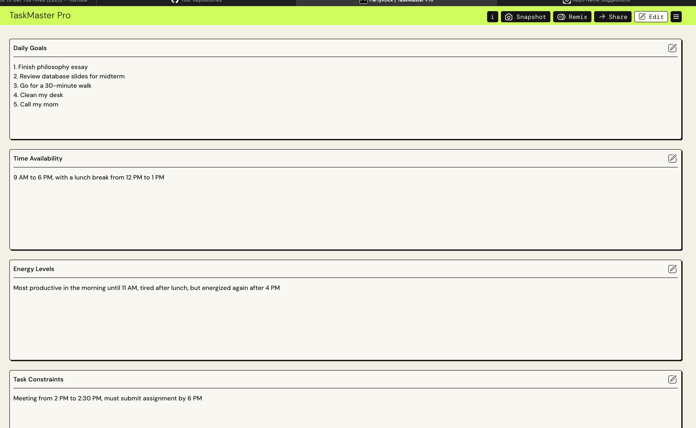
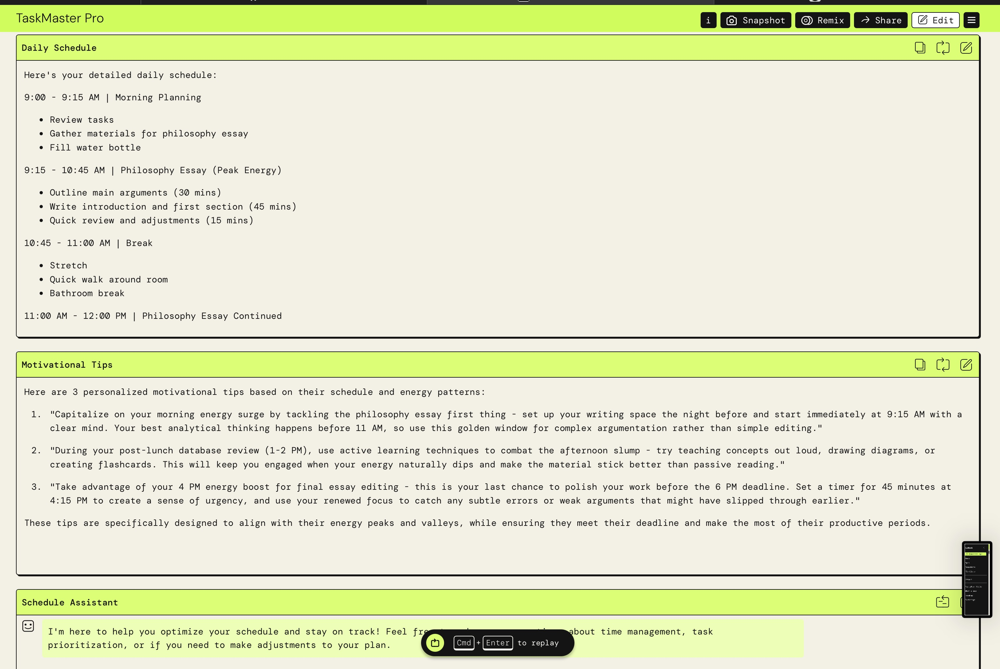

# TaskMaster Pro

TaskMaster Pro is an AI-powered daily task scheduler built using [PartyRock by Amazon Bedrock](https://partyrock.aws). It helps users organize their day based on goals, time availability and energy levels.

## How It Works
- Input your main goals
- Provide available hours
- Add your energy level info
- The app generates a customized daily task plan

## Live App  
Try it here: [https://partyrock.aws/u/malika2470/kbAKk4NLD/TaskMaster-Pro](https://partyrock.aws/u/malika2470/kbAKk4NLD/TaskMaster-Pro)

## Screenshots

## Built With
- [PartyRock](https://partyrock.aws)
- Amazon Bedrock Foundation Models

---

